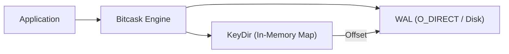

# Architecture Overview

Go-Slipstream is built on a specialized **Bitcask** engine, optimized for write-heavy workloads and distributed state synchronization.

## High-Level Design

The engine follows a "Log-Structured" approach:
- All data is appended to a **Write-Ahead Log (WAL)**.
- An in-memory **KeyDir** stores the mapping of keys to their latest positions in the WAL.
- Reads are highly optimized: 1 seek to find the offset, 1 read to get the value.

## Storage Engine: Bitcask+
The core engine follows the Bitcask design but extends it with "Colossus" level features to address industry-standard criticisms:

### Hybrid KeyDir (Adaptive Indexing)
Traditional Bitcask stores ALL keys in RAM, which limits scalability. Go-Slipstream implements a **Hybrid KeyDir** that:
1. Keeps "hot" (frequently used) keys in a memory hash map.
2. Automatically spills "cold" keys to a disk-based Sorted Log when a RAM threshold is reached.
3. Transparently retrieves keys from either layer, allowing datasets far larger than available RAM.

### Write-Ahead Log (WAL)
Data is appended to the WAL using `O_DIRECT` on supported systems, bypassing the OS page cache for maximum predictable performance. Each entry is encoded with `encoding/binary` for robust cross-platform compatibility.

## The Write-Ahead Log (WAL)

The WAL is the single source of truth. Every record is encoded with a header that includes:
- **Type**: Put, Delete, Commit, Rollback.
- **TxID**: The unique transaction identifier.
- **KeyLength**: Size of the key string.
- **Key**: Raw key bytes.
- **ValueLength**: Size of the (potentially compressed) value.
- **Value**: Raw data bytes.

### O_DIRECT Performance
On Linux systems, Go-Slipstream leverages `O_DIRECT` to bypass the kernel page cache. This ensures:
- **Bare-Metal Speed**: Direct communication with the storage controller.
- **Predictable Latency**: No interference from background kernel flushes.
- **Data Integrity**: Writes are page-aligned (`4096 bytes`) to match hardware sectors.

## KeyDir (In-Memory Index)

The `KeyDir` is a ultra-fast hash map (`map[string]int64`) that keeps the database "hot" in memory. Since only offsets are stored, millions of keys can be managed with minimal RAM consumption.

## Merkle Trees (State Proofs)

Unlike standard Bitcask engines, Go-Slipstream maintains a **Merkle Tree** of its entire state.
- Every `Put` and `Delete` updates the tree.
- The `MerkleRoot()` provides a cryptographic hash of the entire database.
- This root is gossiped across the network to detect inconsistencies between nodes instantaneously.
