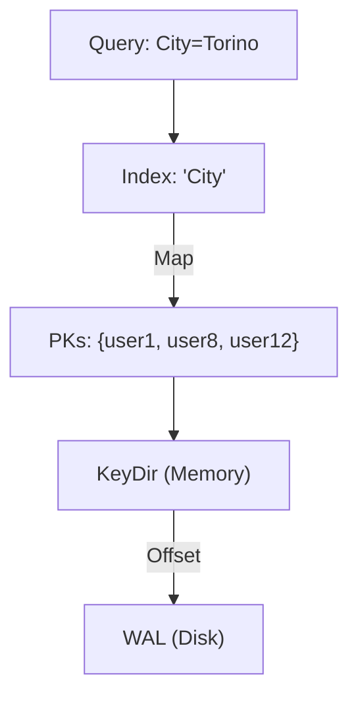

# Querying & Iteration

Go-Slipstream allows you to perform fast, indexed lookups on fields other than the primary key. This transforms the engine from a simple Key-Value store into a powerful query-ready database.

## How it Works

Secondary indices in Go-Slipstream are implemented as **In-Memory Inverted Indices**.
1. **Extractor**: You provide a function that extracts a string value from your data type.
2. **Key Mapping**: The engine maintains a map of `fieldValue -> set[primaryKeys]`.
3. **Lookup**: When you query by index, the engine retrieves the set of primary keys and then fetches the actual data from the WAL via the KeyDir.



## Definition

Indices must be added before inserting data to ensure they are populated correctly:

```go
engine.AddIndex("email", func(u User) string {
    return u.Email
})
```

## Querying

Use the `GetByIndex` method on the `Slipstream` instance. It returns a `Result` object that supports fluent filtering, sorting, and pagination:

```go
users, err := db.GetByIndex(ctx, "email", "alice@example.com").
    Filter(func(u User) bool { return u.Active }).
    Sort(func(i, j User) bool { return i.JoinedAt.Before(j.JoinedAt) }).
    Limit(10).
    Offset(0).
    All()

if err != nil {
    return err
}

for _, user := range users {
    fmt.Printf("Found: %s\n", user.Name)
}
```

## Iteration

If you need to scan the entire database, you can use the `ForEach` method. This performing a full scan of the primary index and retrieves values from the WAL:

```go
err := db.ForEach(func(key string, val User) error {
    fmt.Printf("%s: %v\n", key, val)
    return nil 
})
```

> [!NOTE]
> `ForEach` is a linear operation and may be slow on very large datasets as it requires a disk seek for each record not present in the L1 cache.

## Performance & Memory

- **Read Speed**: Index lookups are near-instant (`O(1)` for the index map + `O(N)` where N is the number of results).
- **Write Overload**: Every index adds a small overhead to `Put` operations during the extraction and map update phases.
- **Memory**: Since the index stores primary key strings, memory usage scales with the number of unique indexed values and the number of keys.

## Updates and Deletion

Go-Slipstream handles index updates automatically. When you update a key, the engine:
1. Reads the old value from disk.
2. Identifies old index entries via the extractor.
3. Removes the old entries and appends the new ones.
4. Ensures consistency even across transactional writes.
